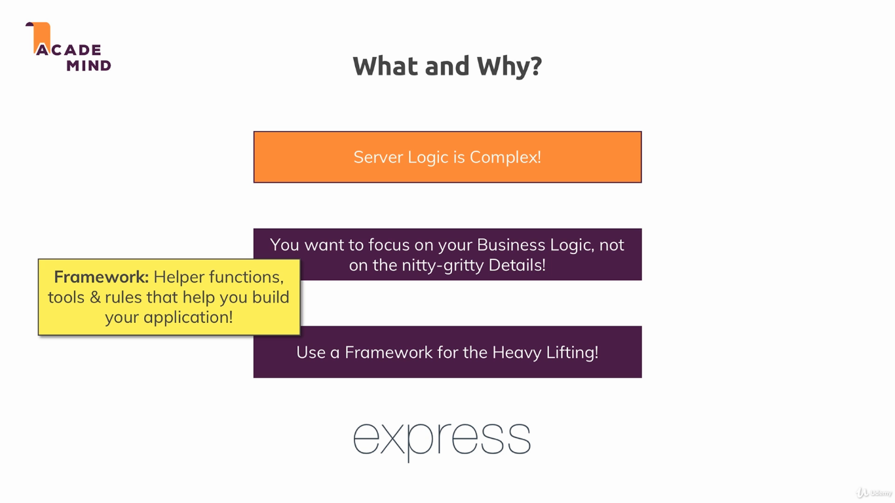
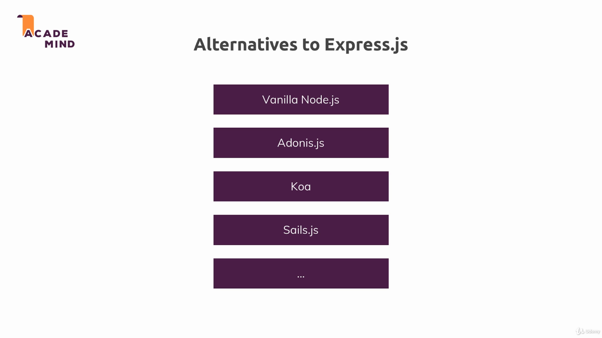
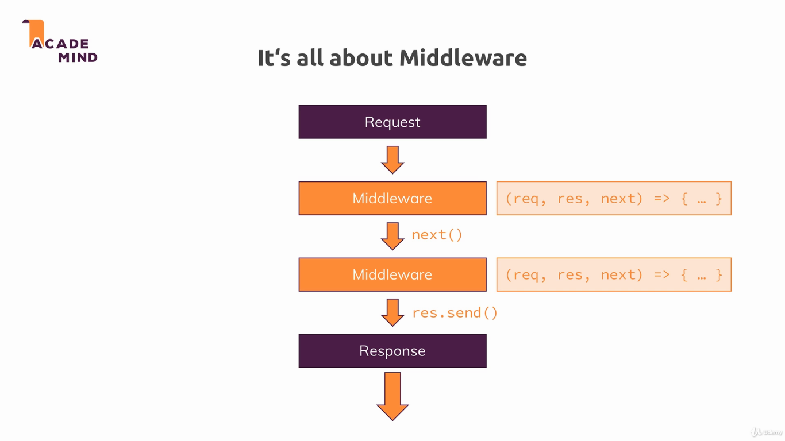
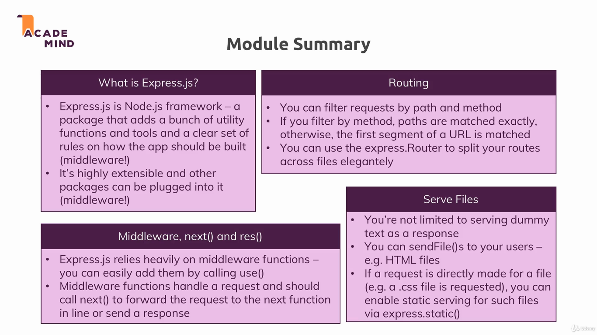

## Express.js

This module introduces the Express framework. Express is a minimal and flexible Node.js web application framework that provides a robust set of features for web and mobile applications [[1]](https://expressjs.com/).

EDITAR

To run the example, simply use `node app.js`. Go to [localhost:3000](localhost:3000) in your browser, type something on the text box and press the button to write your message into `message.txt`.

---

---

---

